# jenkinsonkube 🛞👨‍🍳⚓
jenkinsonkube : Jenkins on Kubernetes Engine | Helm, Jenkins, Kubernetes Cluster |

## Objectives 
- Creating Kubernetes cluster with Kubernetes Engine.
- Creating Jenkins deployment and services.
- Connecting to Jenkins.

## Setting up Jenkins on Kubernetes Engine 

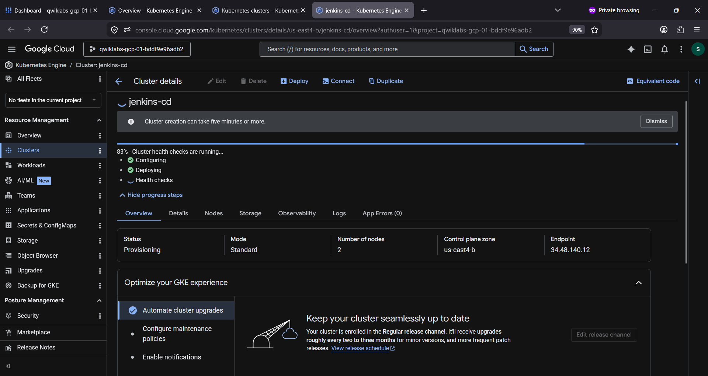

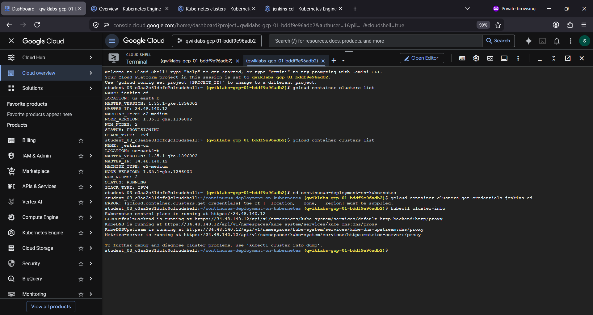

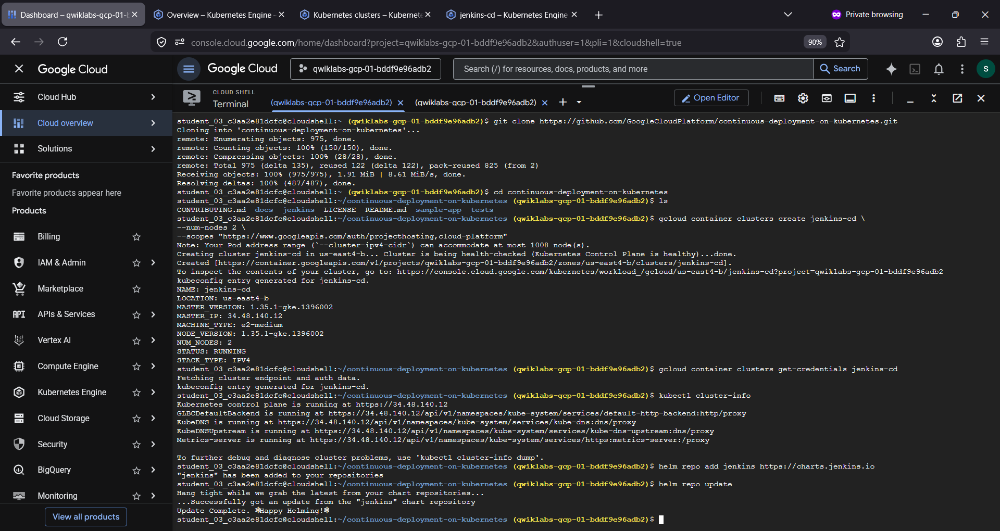

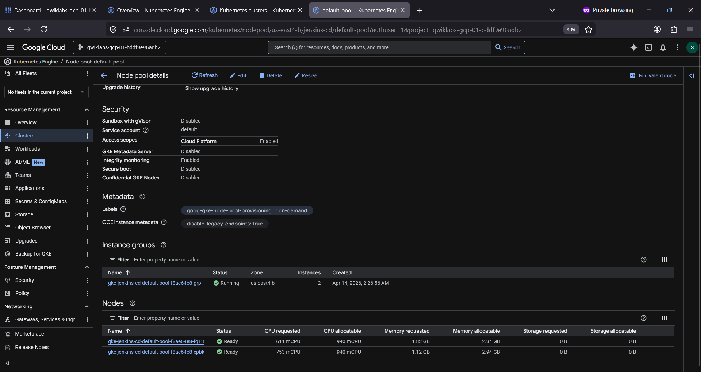

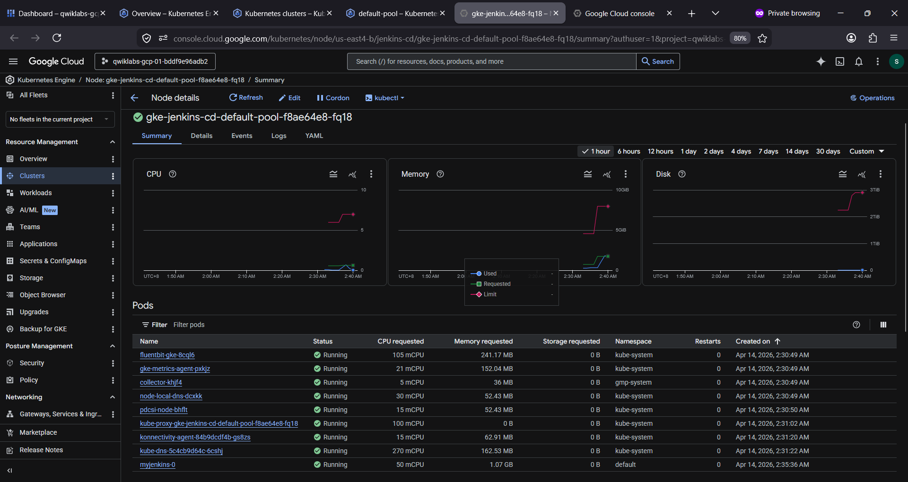

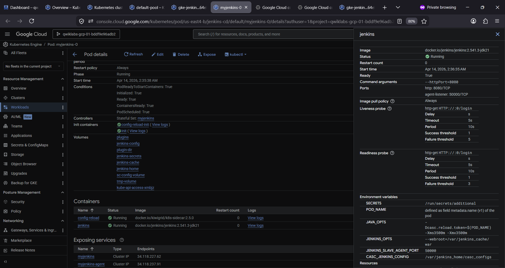

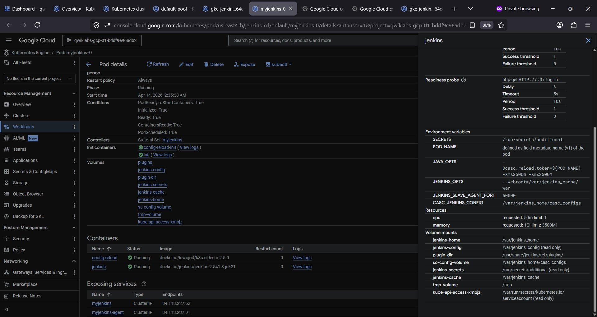

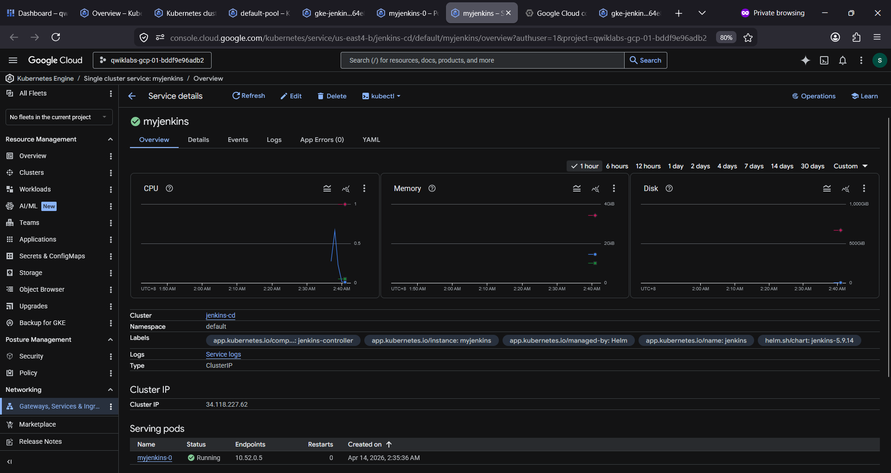

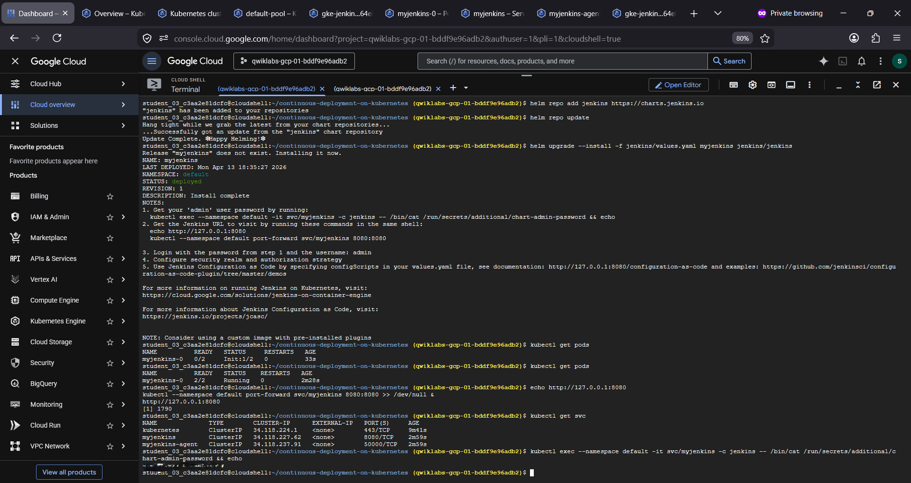

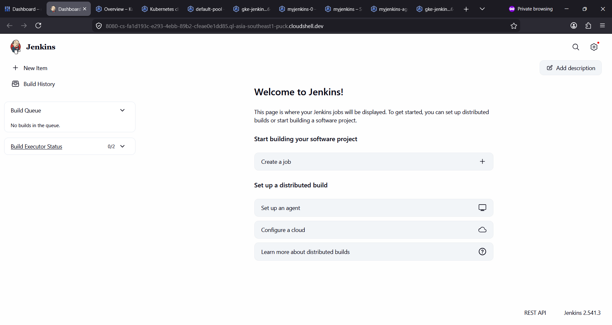

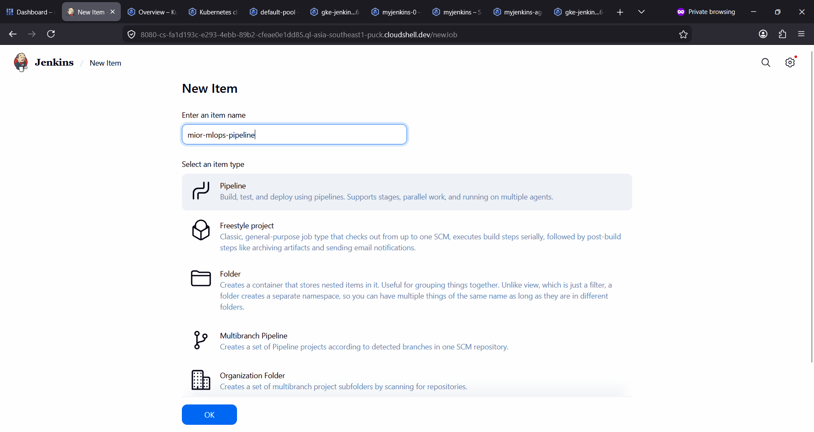

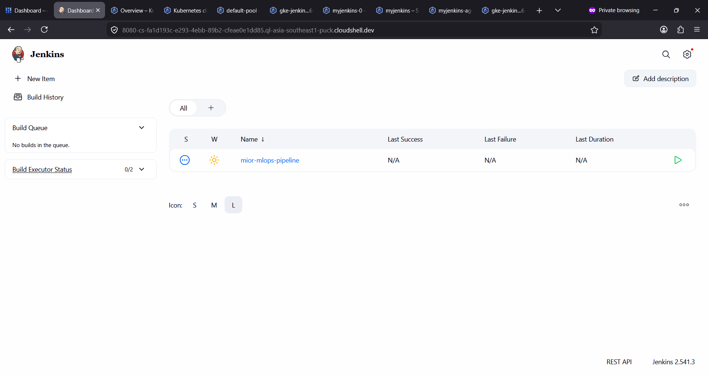
